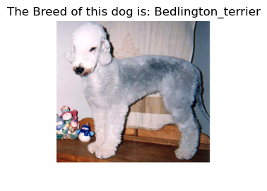
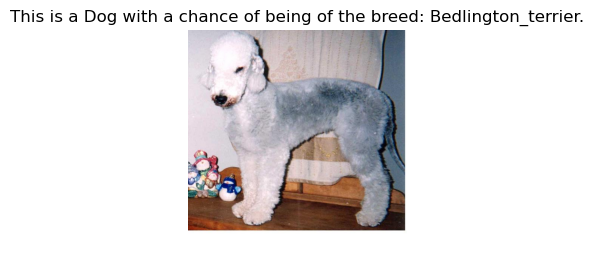
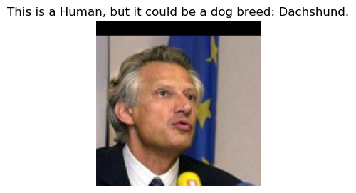
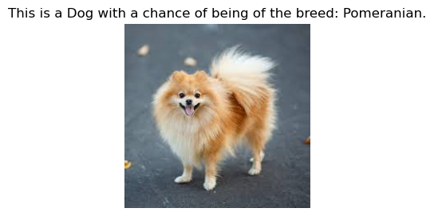
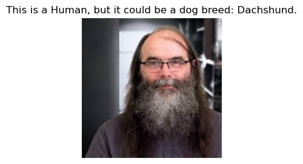
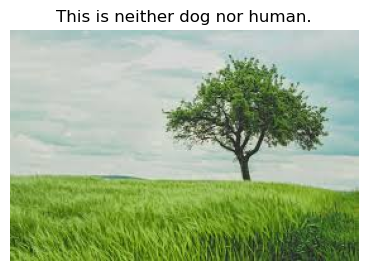
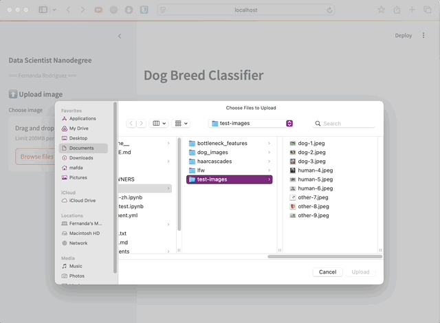

# Dog Breed Classifier

In this project, given an image of a dog, the algorithm will identify an
estimate of the canine’s breed.  If supplied an image of a human, the code will
identify the resembling dog breed.

The image below displays potential sample output of the finished project:


> [See notebook](src/dog_app.ipynb)

## Project Setup

### Clone this repository

```shell
(base)$: git@github.com:mafda/dog_breed_classifier.git
(base)$: cd dog_breed_classifier
```

### Configure environment

- Create the conda environment

    ```shell
    (base)$: conda env create -f environment.yml
    ```

- Activate the environment

    ```shell
    (base)$: conda activate dog_breed
    ```

- Download the [dog
  dataset](https://s3-us-west-1.amazonaws.com/udacity-aind/dog-project/dogImages.zip).
  Unzip the folder and place it in the repo, at location
  `path/to/dog_breed_classifier/data/dog_images`.

- Download the [human
  dataset](https://s3-us-west-1.amazonaws.com/udacity-aind/dog-project/lfw.zip).
  Unzip the folder and place it in the repo, at location
  `path/to/dog_breed_classifier/data/lfw`.

- Donwload the [VGG-16 bottleneck
  features](https://s3-us-west-1.amazonaws.com/udacity-aind/dog-project/DogVGG16Data.npz)
  for the dog dataset.  Place it in the repo, at location
  `path/to/dog_breed_classifier/data/bottleneck_features`.

- Donwload the [Xception bottleneck
  features](https://s3-us-west-1.amazonaws.com/udacity-aind/dog-project/DogXceptionData.npz)
  for the dog dataset.  Place it in the repo, at location
  `path/to/dog_breed_classifier/data/bottleneck_features`.

- Run it:

    ```
    (dog_breed)$: streamlit run app/app.py
    ```

As soon as you run the script, a local Streamlit server will spin up, and your
app will open in a new tab in your default web browser.

Or you can navigate to (http://localhost:8501)[http://localhost:8501].

## Project Structure

```shell
├── README.md
├── app
│   └── app.py
├── data
│   ├── bottleneck_features
│   ├── dog_images
│   ├── haarcascades
│   ├── lfw
│   └── test-images
├── images
├── environment.yml
├── saved_models
└── src
    └── dog_app.ipynb
```

## Results

1. **Detect Humans with OpenCV**: We use OpenCV's implementation of [Haar
   feature-based cascade
   classifiers](http://docs.opencv.org/trunk/d7/d8b/tutorial_py_face_detection.html)
   to detect human faces in images.

```
-> 100% images of the first 100 human_files_short files were detected as human face.
-> 12% images of the first 100 dog_files_short files were detected as human face.
```

2. **Detect Dogs with ResNet-50**: We use a pre-trained
   [ResNet-50](http://ethereon.github.io/netscope/#/gist/db945b393d40bfa26006)
   model to detect dogs in images.

```
-> 0% images of the first 100 human_files_short files were detected as dog.
-> 100% images of the first 100 dog_files_short files were detected as dog.
```

3. **CNN from Scratch**: `Conv2D-16 ReLU, Conv2D-32 ReLU, Flatten, Dense-32 ReLU, Dense-133 softmax`.

```
Test accuracy: 1.0817%
```

4. **Transfer learning with VGG16**: The model uses the the pre-trained VGG-16
   model as a fixed feature extractor, where the last convolutional output of
   VGG-16 is fed as input to our model.




5. **Transfer learning with Xception**: It is a reliable, efficient and widely
   used architecture for transfer learning in image classification tasks due to
   its ability to learn deep features without overfitting.




6. **Best model**

| Model        | Test accuracy |
| ------------ | ------------- |
| CNN          | 1.3221%       |
| VGG16        | 73.0861%      |
| **Xception** | **79.0670%**  |






## App

The web application allows you to select and load an image (dog, human, or
others), to later predict the Dog Breed.



## Conclusions

In this project, we tested three different models: a basic CNN, and transfer
learning with VGG16 and **Xception**. The results showed improvements in
accuracy, as seen in the summary results table. Xception provided the best
performance, improving upon VGG16, which already delivered strong results.
Ultimately, we selected Xception as our top-performing model, and it performed
well even on challenging images, such as a pencil sketch of a dog.

## References

- [Data Scientist Nanodegree
  Program](https://www.udacity.com/course/data-scientist-nanodegree--nd025)

---

made with 💙 by [mafda](https://mafda.github.io/)
